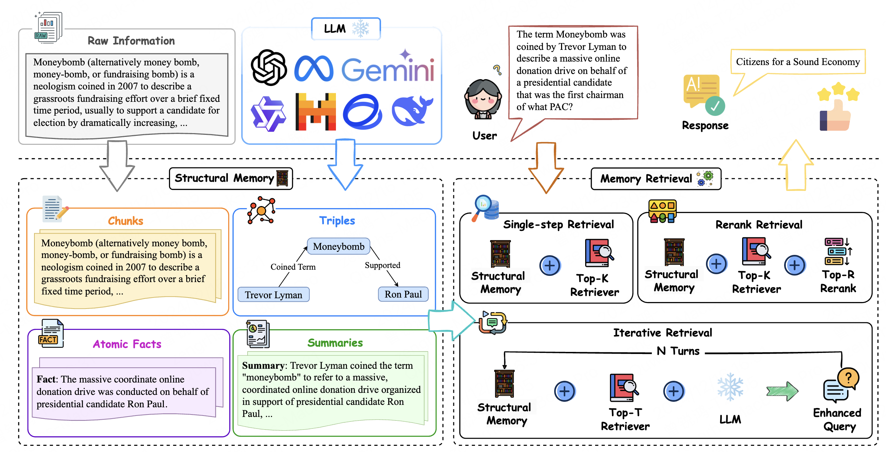

# On the Structural Memory of LLM Agents

This repository contains the PyTorch implementation for our paper. Further details about MGIGNN can be found in our paper.

<p align="center">
  
</p>


## Abstract

Memory plays a pivotal role in enabling large language model~(LLM)-based agents to engage in complex and long-term interactions, such as question answering (QA) and dialogue systems. While various memory modules have been proposed for these tasks, the impact of different memory structures across tasks remains insufficiently explored. This paper investigates how memory structures and memory retrieval methods affect the performance of LLM-based agents. Specifically, we evaluate four types of memory structures, including chunks, knowledge triples, atomic facts, and summaries, along with mixed memory that combines these components. In addition, we evaluate three widely used memory retrieval methods: single-step retrieval, reranking, and iterative retrieval.  Extensive experiments conducted across four tasks and six datasets yield the following key insights:  (1) Different memory structures offer distinct advantages, enabling them to be tailored to specific tasks;  (2) Mixed memory structures demonstrate remarkable resilience in noisy environments; (3) Iterative retrieval consistently outperforms other methods across various scenarios. Our investigation aims to inspire further research into the design of memory systems for LLM-based agents.


## Installation

```shell
pip install -r requirements.txt
```


## Datasets

Please first download the dataset and unzip it into `dataset` directory.

Google Drive Link: https://drive.google.com/drive/folders/1_3d-NYgtaQ-P8VogiMqnOtNBjgsIwdGe?usp=sharing


## How to run

```bash
api_key="" # OpenAI key
ablation_type="memory_units_with_top_k"
top_k=100
top_r=0
top_s=0
top_t=50
num_turns=4
answer_with_memory_units=1
use_iterative_retrieval=1
maximum_tokens=4096
debug=0
reader_model="gpt-4o-mini"
num_noise_docs=0

python run_readers.py --api_key $api_key \
          --dataset $dataset \
          --memory_repr $memory_unit \
          --ablation_type $ablation_type \
          --answer_with_memory_units $answer_with_memory_units \
          --use_iterative_retrieval $use_iterative_retrieval \
          --top_k $top_k \
          --top_r $top_r \
          --top_s $top_s \
          --top_t $top_t \
          --num_turns $num_turns \
          --debug $debug \
          --maximum_tokens $maximum_tokens \
          --reader_model $reader_model \
          --num_noise_docs $num_noise_docs
```

